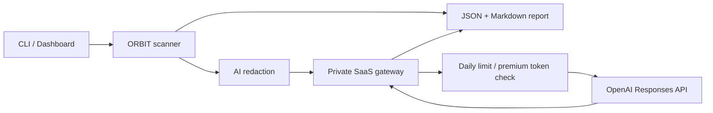

# Architecture

ORBIT is split into a publishable client and a private SaaS gateway.

## Public Client

The public repository contains:

1. `orbit.scanner`: orchestrates scanner modules and produces a normalized `ScanReport`.
2. `orbit.scanners`: DNS, TLS, HTTP, exposure, and port posture checks.
3. `orbit.server`: optional local FastAPI dashboard.
4. `orbit.ai_client`: redacted report submission to the hosted gateway.
5. `orbit.report`: JSON and Markdown report rendering.

## Private SaaS Gateway

The OpenAI-backed gateway is local-only under `private_saas/` and is ignored by git. It owns:

- `OPENAI_API_KEY`,
- simple usage counting,
- free daily limits,
- premium token bypasses,
- OpenAI Responses API calls.



## Scanner Contract

Each scanner module implements:

```python
run(target: Target, options: ScanOptions) -> tuple[dict[str, Any], list[Finding]]
```

Scanner modules return observations for traceability and findings for risk reporting. The orchestrator isolates scanner failures so one broken module does not destroy the entire report.

## Report Contract

The report model includes:

- normalized target metadata,
- scanner options,
- observations,
- findings,
- risk score,
- deterministic summary,
- optional AI summary and usage metadata.

This makes reports suitable for CLI output, dashboard rendering, API storage, scheduled diffing, and future account workspaces.
